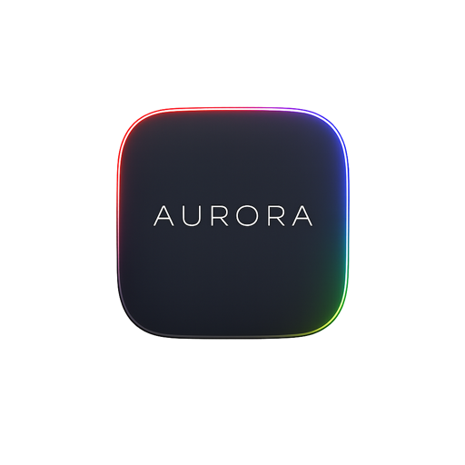
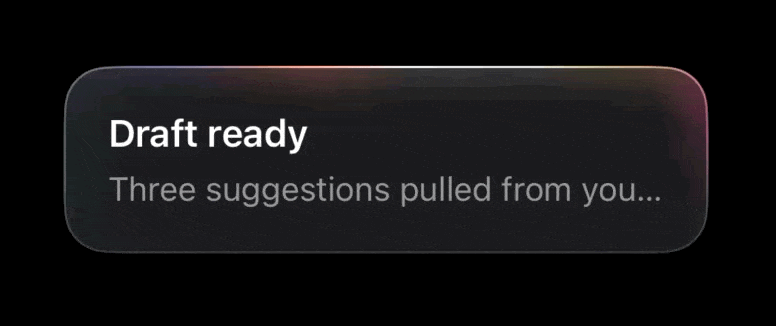
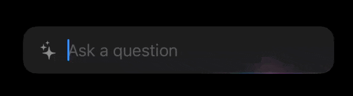
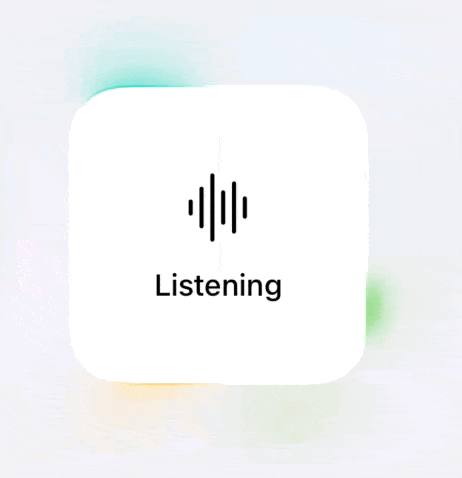

<p align="center">
  
</p>

# Aurora

An animated border glow for SwiftUI and UIKit. Five presets, your colors, tuned separately for dark and
light appearances.

```swift
CardView()
    .aurora(.regular, in: .rounded(cornerRadius: 20))
```

## See it

<p align="center">
  <br>
  <sub><code>.regular</code> — a band of light sweeps the whole border, with <code>showsBorder</code> tracing the edge it travels</sub>
</p>

<p align="center">
  <br>
  <sub><code>.underline</code> — the bottom edge only, bound to <code>@FocusState</code> so it lights while the field holds the caret</sub>
</p>

<p align="center">
  <br>
  <sub><code>.pulseOutward</code> — breathes past the bounds as an uncropped halo, here on a light appearance</sub>
</p>

## Requirements

iOS 17, macOS 14, tvOS 17 or visionOS 1. Swift 6 language mode with complete concurrency checking. No
dependencies, no resource bundle.

Built and tested here against **iOS and macOS only**. tvOS and visionOS are declared and the UIKit surface
is `canImport`-guarded for them, but neither has been compiled — verify before shipping to either. The risk
sits in the UIKit half of `Aurora`, which reaches for `registerForTraitChanges`, `UIColor.label` and
`overrideUserInterfaceStyle`; `AuroraCore` is CoreGraphics-only and `Aurora` is plain SwiftUI.

## Install

```swift
dependencies: [
    .package(url: "https://github.com/your-org/Aurora.git", from: "1.0.0")
]
```

| Product | Use it for |
|---|---|
| `Aurora` | Everything. SwiftUI *and* UIKit, in one module. |
| `AuroraCore` | Writing your own renderer against `AuroraSceneBuilder`. No UI framework. |

Add `Aurora` and `import Aurora`. That is the whole story: both UI surfaces live in one module, and it
re-exports `AuroraCore`, so `AuroraConfiguration`, `AuroraStyle`, `AuroraShape` and `AuroraColor` come with
it. There is never a second product to add or a second import to remember.

The UIKit files are `canImport(UIKit)`-guarded, so on macOS they compile away and you are left with the
SwiftUI surface. There is no separate UIKit product because there is nothing to separate: `AuroraView`
renders through two `UIHostingController`s, since `CALayer.filters` is unavailable to app code on iOS and
per-layer Gaussian blur has no pure-UIKit path. A UIKit-only app was always going to link SwiftUI, so
splitting the two bought nothing and cost an import.

`AuroraCore` stays exposed for the rare case of driving `AuroraSceneBuilder` into your own backend. You
never list it as a dependency otherwise.

Two products, nothing else. The demo screens live in `Examples/` and compile into the demo apps only —
depend on Aurora and you inherit the component, not a browser for it.

## Attaching it to a component

There are only ever two things to say at the call site: **which preset**, and **what outline the host is
clipped to**.

```swift
CardView()
    .aurora(.regular, in: .rounded(cornerRadius: 20))
```

Everything else — palette, appearance, intensity, tempo — comes from an `AuroraStyle` in the environment.
That split is deliberate, and it is what makes the effect safe to put inside a reusable component: the
component knows its own shape, and the app knows its own colours. Neither has to know the other.

```swift
// The component. Says where the glow goes, and nothing about how the app looks.
struct SummariseButton: View {
    var body: some View {
        Text("Summarise")
            .padding(.horizontal, 20)
            .frame(height: 40)
            .background(.fill, in: .capsule)
            .aurora(.compact, in: .capsule)
    }
}

// The app. Answers the colour question once, for everything below.
// `brandBlue` is an AuroraColor, e.g. AuroraColor(r: 70, g: 140, b: 255).
RootView()
    .auroraStyle(AuroraStyle(colorVariant: .tinted(brandBlue), strength: 0.8))
```

Override per call when one view has to differ, and adjust part of the inherited style for a subtree:

```swift
ErrorCard().aurora(.regular, in: .rounded(cornerRadius: 20), colorVariant: .tinted(errorRed))

SettingsList().auroraStyle(strength: 0.5)   // keeps the inherited palette
```

### Name the shape, not a radius

`in:` takes an `AuroraShape`, not a number:

| Shape | Radius it traces |
|---|---|
| `.rounded(cornerRadius: 20)` | 20, clamped to half the host's short side |
| `.capsule` | Half the short side, measured. Circles too |
| `.preset` | The preset's own tuned radius. The default |

A radius is a value you have to keep in step with the `clipShape` you already wrote, and nothing checks
that you did. Worse, the correct number is often unknowable up front: a capsule's radius is half its
height, so a control that grows with Dynamic Type has no single radius to pass. Naming the shape defers
the arithmetic to the moment the host has been measured, which is the only moment it can be right.

Square corners are `.rounded(cornerRadius: 0)`. Every case is clamped, so an oversized radius degrades to
a capsule instead of inverting the corner arcs.

### Let the effect draw the border too

A host with no border of its own gives the sweep nothing to travel along, so the glow reads as an edge
appearing and vanishing. `showsBorder` traces the outline and lets the effect light it:

```swift
CardView()
    .aurora(.regular, in: .rounded(cornerRadius: 20), showsBorder: true)
```

The outline belongs to the light rather than sitting under it: away from the head it fades to almost
nothing, so no resting hairline draws a box around the host. For `.compact` and `.regular` it is **swept**,
on the same angle as the colored ring, so the two arcs stay locked together. The other presets have no
angular head to follow, so they draw it steady rather than ignoring the flag.

It takes no color from the palette — white on a dark appearance, and a mid **grey** on a light one. Grey
rather than black, which is what the masks use: black is right for *coverage*, deepening a light surface the
way white brightens a dark one, and wrong for a hairline, where it reads as an outline someone drew instead
of an edge catching the light.

You could hand-roll the colour — white-on-dark and black-on-light is just `Color.primary` — but not the
motion. Nothing outside the library can see the sweep's phase, so a hand-rolled outline sits dead while the
glow travels over it. In UIKit it is worse than that: `layer.borderColor` is a `CGColor`, resolved once,
which does not follow a trait change, so a hand-rolled border has to be re-resolved on every appearance
flip. `showsBorder` does both for you.

## SwiftUI

Wrap a view, or attach the modifier — they are equivalent, and the modifier reads better in a chain:

```swift
import Aurora

Aurora(.regular, in: .rounded(cornerRadius: 20)) {
    CardView()
}

CardView()
    .aurora(.regular, in: .rounded(cornerRadius: 20))
```

Drive it from state, and get told when each ramp finishes:

```swift
CardView()
    .aurora(
        .pulseInward,
        in: .rounded(cornerRadius: 20),
        isActive: viewModel.isProcessing,
        onActivate: { analytics.log(.auroraShown) },
        onDeactivate: { analytics.log(.auroraHidden) }
    )
```

Pass a whole `AuroraConfiguration` when it is computed, held in a view model, or read from a design token.
That form ignores the inherited style, since it has already answered every question the style asks:

```swift
CardView().aurora(configuration: viewModel.auroraConfiguration)
```

## UIKit

One line, same vocabulary:

```swift
import Aurora

button.addAurora(.compact, in: .capsule)
field.addAurora(.underline, in: .rounded(cornerRadius: 14))
```

`addAurora` wraps the view in place. It copies the constraints that referenced the view and re-points them
at the wrapper, so a view that is already installed and constrained survives the re-parenting.

UIKit has no environment to carry a style down a hierarchy, so hold one somewhere and hand it over. That is
the same split as the SwiftUI version, moved by hand:

```swift
let style = AuroraStyle(colorVariant: .tinted(brandBlue), strength: 0.8)
button.addAurora(.compact, in: .capsule, style: style)
```

When you are assembling a hierarchy from scratch, build the wrapper directly rather than mutating:

```swift
let glow = AuroraView(
    contentView: card,
    configuration: AuroraStyle.standard.configuration(.pulseOutward, in: .rounded(cornerRadius: 20))
)
view.addSubview(glow)

glow.isActive = viewModel.isProcessing
```

## Presets

| Preset | Motion | Reach for it when |
|---|---|---|
| `.compact` | Light sweeps the border | Buttons, chips, toggles, anything control-sized |
| `.regular` | Light sweeps the border | Cards, panels, sheets. The default |
| `.underline` | Light travels the bottom edge | Text fields and search bars |
| `.pulseInward` | Breathes inside the border | Reporting an ongoing state |
| `.pulseOutward` | Breathes as an outward halo | Pulling attention to a whole card |

Nothing rotates in the sweeping presets. The colored perimeter is a fixed stack of soft elliptical blobs
pinned to the edges and corners; an angular mask advances once per cycle and reveals a bright arc of it.
The palette never moves, which is why the same blobs also drive both breathing presets.

### `.compact` vs `.regular`

They look like one preset with a size knob. They are not: they are two separate tunings of the same motion,
because a 1pt ring on a 40pt-high button has different problems from the same ring on a 180pt card.

Both sweep the whole border, and both take **1.96 seconds** per cycle. Everything else differs:

| | `.compact` | `.regular` |
|---|---|---|
| Palette | Its own 8-blob table, radii 4–59pt | The shared 9-blob table, radii 20–180pt |
| Blobs scale with the host | Yes, from a 70×36 reference | No |
| Inward glow | Its own authored table | Derived from the ring at 0.9× |
| Ring opacity (dark) | 0.46 | 0.26 |
| Inward glow opacity (dark) | 0.24 | 0.42 |
| Bright arc of the cycle | 36% | 28% |
| Inner shadow blur | 5pt | 9pt |
| Default corner radius | 32pt | 16pt |

Each of those follows from the size of the thing being decorated:

- **The ring is nearly twice as bright**, and **the inward glow is roughly half as strong.** A short
  perimeter gives the eye less to catch, so the border itself has to carry the effect. Meanwhile a control
  is mostly label: a `.regular`-strength inward glow would wash across the text and hurt legibility, where
  on a card it has empty middle to spread into.
- **The bright arc is wider** — 36% of the cycle against 28%. The head crosses a short perimeter quickly,
  and a narrow arc at that speed reads as a blink rather than as light travelling.
- **The inner shadow is tighter**, 5pt against 9pt, because it has to seat against a much smaller box.
- **The blobs scale with the host, and only for `.compact`.** Blob positions are fractions and need
  nothing, but radii are absolute points. The compact palette's widest blob is 59pt against a 70pt-wide
  reference control, so left unscaled it would cover 84% of a chip and 30% of a wide button. `.regular` is
  authored for a card and reads correctly across the range a card spans, so it carries no reference box and
  is not scaled at all.

**Which to pick.** Go by the host's height, not by what the element is called. Under roughly 60pt, use
`.compact`. A card is `.regular` even when it is small; a tall button is still `.compact`. If you are
unsure, try `.regular` on the control: if the glow inside the border competes with the label, that is the
tell.

### Use cases

A capsule button that glows while work is in flight. `.capsule` means no radius arithmetic, and it stays
right when Dynamic Type changes the height:

```swift
Button("Summarise", action: summarise)
    .buttonStyle(.plain)
    .padding(.horizontal, 20)
    .frame(height: 40)
    .background(.fill, in: .capsule)
    .aurora(.compact, in: .capsule, isActive: viewModel.isSummarising)
```

A text field that glows while it holds the caret. This is what `.underline` is for, and binding it to focus
is how you would ship it:

```swift
@FocusState private var isFocused: Bool

TextField("Ask a question", text: $query)
    .focused($isFocused)
    .padding(.horizontal, 16)
    .frame(height: 48)
    .background(.fill, in: .rect(cornerRadius: 14))
    .aurora(.underline, in: .rounded(cornerRadius: 14), isActive: isFocused)
```

A card that reports a long-running job. `.pulseInward` breathes without travelling, which reads as a state
rather than as progress:

```swift
Aurora(.pulseInward, in: .rounded(cornerRadius: 20), isActive: job.isRunning) {
    JobStatusCard(job: job)
        .background(.background.secondary, in: .rect(cornerRadius: 20))
}
```

A halo to pull the eye to one card in a list. Note the padding: this preset paints outside its bounds, so
the neighbouring row must not sit on top of it:

```swift
ForEach(results) { result in
    ResultCard(result: result)
        .background(.background.secondary, in: .rect(cornerRadius: 20))
        .aurora(.pulseOutward, in: .rounded(cornerRadius: 20), isActive: result.isRecommended)
        .padding(.vertical, result.isRecommended ? 24 : 0)
}
```

A whole screen tinted to a brand colour, with one control deliberately off-palette:

```swift
NavigationStack { ComposeScreen() }
    .auroraStyle(AuroraStyle(colorVariant: .tinted(brandBlue)))

// Inside ComposeScreen, the destructive action opts out.
DeleteButton()
    .aurora(.compact, in: .capsule, colorVariant: .tinted(destructiveRed))
```

### `.pulseOutward` needs an opaque view

That preset draws its core and halo *behind* the content and lets them spill past the bounds. Over a
translucent view the halo shows through the middle and reads as a smear. Two things follow:

- Give the wrapped view an opaque background.
- Keep `clipsToBounds` off on ancestors, or the halo gets cut at the edge. In SwiftUI, leave room with
  `.padding()` so a neighbouring row does not sit on top of it.

## Palettes

Three cases, and the colors are yours:

```swift
.aurora(configuration: AuroraConfiguration(size: .regular, colorVariant: .glow))
.aurora(configuration: AuroraConfiguration(size: .regular, colorVariant: .tinted(brandBlue)))
.aurora(configuration: AuroraConfiguration(size: .regular, colorVariant: .multiColor([teal, indigo])))
```

| Case | What it draws |
|---|---|
| `.glow` | The authored full-spectrum palette. The default. |
| `.tinted(_:)` | One hue, multiplied through the palette. |
| `.multiColor(_:)` | Several hues, dealt across the palette's blobs in order and repeating as needed. |

`.neutral`, `.cool` and `.warm` are ready-made values built on those three, so the common cases still have
a name: `.neutral` is `.tinted(.white)`, and the other two are combinations.

### Colors are multiplied in, not substituted

Aurora ships two authored tables. `.glow` uses the full-spectrum one as tuned. `.tinted` and `.multiColor`
sit on an achromatic table whose value is not its color but its *structure*: nine soft blobs with tuned
positions, radii and relative brightness.

That relative brightness is the whole asset. It is what makes the ring read as separate pools of light
rather than one flat band, so your hue is multiplied through each blob's own brightness rather than
replacing it. Substituting the colors outright would collapse all nine to one shade.

For `.multiColor`, hues are dealt by blob and not by gradient stop — two colors alternate around the ring,
nine land one per blob. Each blob keeps a single hue, so a spike never runs through your whole combination
and smears.

### A single hue is dimmed and held still

One predicate decides both, and both come from the same fact: the achromatic table is uniformly bright by
design, and a uniformly bright ring at full opacity reads as a hard band rather than a glow.

- **Dimmed** on dark appearances, by half. `.glow` and any `.multiColor` with two or more colors break that
  uniformity themselves, so they are left alone.
- **Held still** — no hue drift. You named a color; Aurora does not walk away from it. `.glow` and
  multi-color combinations do drift, within `hueRange`. Pass `hueRange: 0` to hold a combination exactly.

### Every palette adapts to the appearance

`theme` picks which set of tuned colors to use. Pass `.auto` to follow `\.colorScheme` in SwiftUI or the
view's `traitCollection` in UIKit. The UIKit view reads its own traits rather than the app-wide setting,
so a card inside a container that sets `overrideUserInterfaceStyle` still matches the surface it sits on.

The achromatic table is authored as a *light* glow, which is right on a dark surface and wrong on a light
one — where the effect has to deepen rather than brighten, the way the rest of the light tuning does. So on
light appearances it darkens to half brightness, and its opacity is left unhalved.

Both numbers come from the tuning rather than taste. The two tables that already ship per-appearance greys
— `.underline`'s own line and bloom — put their light values at 0.487 and 0.488 of their dark ones across
sixteen pairs, so half is what the design says. The halving is skipped because it exists to tame a *bright*
uniform grey on a dark surface; stacked onto light's already-lower presets it drops `regular`'s stroke to
0.06, where it disappears against the card.

Because the darkening happens on the base, *before* your hue is multiplied in, every tint and combination
gets the light tuning for free — and only brightness moves. The hue arrives unchanged.

## Options

Every optional means "use the preset's tuned value" rather than a single global default. That distinction
matters: unset brightness resolves to 1.9 for `.pulseOutward` on a dark appearance and 1.3 for `.regular`, so
a plain default in the initializer would flatten five separately tuned presets into one.

| Property | Default | Notes |
|---|---|---|
| `size` | `.regular` | Which preset. |
| `colorVariant` | `.glow` | Which palette. |
| `theme` | `.auto` | Follows the surrounding color scheme. Pin it only to compare the two tunings. |
| `shape` | `.preset` | The outline to trace. See [Name the shape](#name-the-shape-not-a-radius). |
| `showsBorder` | `false` | Traces the host's outline and lets the effect light it. |
| `borderWidth` | preset | Ring thickness in points. |
| `duration` | preset | Seconds per cycle. |
| `strength` | `1` | Overall intensity, `0...1`. Never touches your content. |
| `brightness` | preset | Multiplicative. |
| `saturation` | preset | |
| `hueRange` | `30°` | Drift either side of the base hue. |
| `staticColors` | `false` | Freezes the hue animation. |

### There is no auto-detection

A SwiftUI view has no queryable corner radius, and reading one back from a rendered snapshot would be slow
and unreliable. Leave `shape` unset and you get `.preset`, the preset's own radius, which will look wrong
against a differently rounded host. Name the shape you clipped to.

## Accessibility

Under Reduce Motion the glow stays visible and stops moving: the clock stops and the effect settles on a
representative frame. Removing the glow would change what the layout communicates, not only how it
animates.

The aurora is decorative throughout. It disables hit testing, so taps reach your content, and it stays
hidden from assistive technologies.

## Snapshot testing

The glow advances every frame, so capturing one reproducibly needs the clock pinned:

```swift
let renderer = ImageRenderer(
    content: CardView()
        .aurora(.regular, in: .rounded(cornerRadius: 20))
        .auroraClockFrozen(at: 0.98)
)
```

Freezing also treats the activation ramp as finished, so a single pass renders a fully faded-in glow
rather than the first frame of a fade.

Pick the instant carefully for `.underline`. Its edge fade sits at zero for the first eighth of the cycle, so
freezing near zero captures an empty frame — choose something between 33% and 67% of the duration.

## Performance

- **Breathing presets sample at 30 Hz.** Their oscillators run on 1.6–6.4 second periods, so a 120 Hz
  display would rebuild the gradient stack four times per visible change. Snapping time to a 30 Hz grid
  cuts that to a quarter.
- **The wide halo is frozen.** Its blobs sit at the time-average of their breathing range, so the most
  expensive layer rasterizes once instead of every frame. Under 22 points of blur the difference is
  invisible.
- **Offscreen glows stop.** SwiftUI drives this from `onAppear` and `onDisappear`; the UIKit view uses
  `didMoveToWindow` and `isHidden`. Once an inactive glow finishes fading out, its clock stops rather
  than ticking over an empty scene.

## Architecture

```
AuroraCore     tuning, palettes, oscillators, scene builder (CoreGraphics only)
   └── Aurora  SwiftUI: Aurora, .aurora(), Canvas renderer
               UIKit:   AuroraView, UIView.addAurora()   (canImport(UIKit) only)

Examples/      demo apps, outside the package: not products, not public API
```

Public types carry the `Aurora` prefix; internal ones carry none, because inside a module a prefix earns
nothing. So `SceneView`, `SceneRenderer`, `Appearance`, `PulseDriver` and the test suites are unprefixed,
while everything a consumer can name is `Aurora…`.

### The tuning is data, held in Swift

`Sources/AuroraCore/Tuning/` holds every palette, opacity, keyframe track and oscillator as Swift
literals, split by area. `TuningTypes.swift` and `Tuning.swift` are hand-written; the
`Tuning+*.swift` files are generated data, edited only when the design changes.

Literals rather than a bundled payload, for three reasons: the values are type-checked at build time,
the package needs no resource bundle and keeps working when its sources are vendored directly into an
app, and there is no load step that can fail at runtime.

Every table is keyed by an enum — `[AuroraSize: …]`, `[AuroraResolvedTheme: …]`, `[PaletteBase: …]` — so a
wrong shape is a compile error. `TuningTests` covers the rest: that no table is merely *missing* an entry,
and that every keyframe and stop table is sorted inside `0...1`.

**None of it is public.** Every declaration under `Tuning/` is `package`, so it is visible to Aurora's own
targets and invisible to anything that depends on the library. Its types carry no `Aurora` prefix for the
same reason — the prefix earns its keep on a public name and only adds noise on an internal one.

`package` rather than `internal` because `Sources/Aurora` is a separate module and reads
`Tuning.standard.defaults` for the fade durations and the pulse sample rate. Two public entry points would
otherwise have leaked a tuning type into their signatures, so each is split: a public
`resolved(isDarkEnvironment:)` that uses the shipped tuning, and a `package`
`resolved(isDarkEnvironment:tuning:)` that takes one. Nothing is lost by hiding the parameter — a
consumer could never construct a `Tuning` to pass it.

`AuroraGradientStop` is the one type that moved *out* of `Tuning/`. It is scene vocabulary the renderers
consume, not tuned data, and it had only ever been filed there by accident.

### One scene, two renderers

`AuroraSceneBuilder` turns a configuration and a timestamp into a `AuroraScene`: layers, gradients, masks,
clips, blurs. It holds no mutable state, so the same inputs always produce the same frame. The renderers
only know how to draw one.

Two consequences worth knowing about:

- Reduce Motion is a pinned timestamp, not a second code path.
- Every tuned decision is testable without a view hierarchy or a snapshot. The suite covers all five
  presets across four palettes and both appearances.

### Color adjustment is a matrix

Each layer carries a hue rotation, a multiplicative brightness and a saturation change. The obvious
SwiftUI translation is wrong twice over: `.brightness(_:)` adds a constant where the tuning needs a
multiply, and `.hueRotation(_:)` is an HSB rotation where the tuning assumes the luminance-preserving
matrix. Chaining view modifiers also filters once per modifier instead of once over the finished layer.

So `AuroraColorMatrix` composes the exact matrices and the builder bakes the result into the gradient
stops. That is safe because the matrices carry no bias term and leave alpha alone, which makes them
commute with source-over compositing: adjusting each source gives the same pixels as adjusting the
composited result. `AuroraColorMatrixTests` asserts that property directly, so an edit that breaks it
fails a test rather than shifting every overlapping blob by a few percent.

### Why the UIKit view hosts SwiftUI

`AuroraView` renders through the same SwiftUI renderer the `Aurora` view uses. The effect needs a
real Gaussian blur per layer, and `CALayer.filters` is unavailable to app code on iOS, so a hand-rolled
UIKit version would push every blurred layer through Core Image each frame. That is slower, and it leaves
two rendering paths to keep in step.

None of it reaches the API. `AuroraView` is a plain `UIView` with UIKit properties, and callers never
import SwiftUI.

### Typed oscillator targets

Each breathing oscillator names what it drives as a `PulseTarget` case rather than a string. The
compiler then checks the routing is exhaustive. An earlier version keyed on names, where a value that
failed to route would fall back to its neutral default — so the motion would go *missing* rather than
look wrong, which is the harder bug to notice.

## Examples and previews

**Previews work with no project at all.** Open the package in Xcode and use
`Sources/Aurora/Previews.swift` — one preview per preset, plus the four palettes, the light appearance and
a frozen frame. `Sources/Aurora/UIKitPreviews.swift` does the same for the UIKit surface.

```sh
open .
```

Those previews sit in the shipping targets because a preview only renders when some scheme builds the
file it is in; anything under `Examples/` belongs to no target, so Xcode refuses to preview it. They are
wrapped in `#if DEBUG`, so they cost a release build nothing.

For live controls — palette, tint, intensity, appearance and the activation fade — run one of the demo
apps. No extra tooling:

```sh
open Examples/AuroraExamples.xcodeproj
```

Two schemes, `AuroraSwiftUIExample` and `AuroraUIKitExample`, each linking this package as a local
dependency. Both are shaped the same way: a list of the five presets, and one screen per preset holding
the effect and its controls together.

One preset per screen rather than all five on one scroll. Each then gets a host that suits it —
`.underline` wraps a live text field and glows while it holds the caret, `.pulseOutward` gets the room its
halo needs — and only one glow animates at a time, which is how you would ship it. The settings live in a
shared model, so a palette picked on one preset is still selected when you open another.

An iOS app needs an Xcode project: SwiftPM builds libraries and command-line executables, not `.app`
bundles, and `swift package generate-xcodeproj` was removed in Swift 5.9. So the project is committed
rather than generated from a manifest — one fewer tool to install, at the cost of a `.pbxproj` that
conflicts badly on merge. It is kept as small as the format allows (`objectVersion = 77` with
file-system-synchronized groups), so files added to either example folder are picked up without the
project file changing at all.

The UIKit demo shows both attachment styles: `AuroraView(contentView:)` for a hierarchy built from
scratch, and `addAurora(_:in:style:)` for the text field, which gets constrained before it is wrapped.

## Tests

```sh
swift test
```

73 tests across seven suites. Six cover values — tuning completeness, timeline and keyframe sampling, the
color matrix, geometry, the breathing oscillators, scene composition for every preset. The seventh
rasterizes frames through `ImageRenderer` and counts painted pixels.

That split exists for a reason: an early version of this package built cleanly, passed every value test,
and drew nothing at all. A scene can be perfectly specified and never reach the screen, so
`AuroraTests` asserts that the decisions arrive as pixels.

Three cases are worth reading before changing anything:

- `someOpacitiesExceedOne` — four presets store an opacity above 1, because the tuning was authored where
  clamping happens for you. Left unclamped, premultiplied alpha climbs past 1 and compositing breaks
  down: the `.pulseOutward` light hairline blows out and stops tracing the corners.
- `lineIsDarkAtCycleStart` — the `.underline` preset's edge fade sits at zero for the first eighth of its
  cycle, so a frame sampled at `time: 0` is legitimately empty. Any frozen frame has to land mid-cycle.
  This is the detail most easily mistaken for a broken effect.
- `stoppedClockStillPaints` — the activation ramp is derived from elapsed time, and a stopped clock never
  advances it. Reading the ramp against a stopped clock pinned it at zero, which hid the effect outright
  for anyone with Reduce Motion enabled.

## Credits

Inspired by the Border Beam Effect from Kavsoft:
[youtube.com/watch?v=DHqLSjgBNPY](https://www.youtube.com/watch?v=DHqLSjgBNPY)

## License

MIT.
